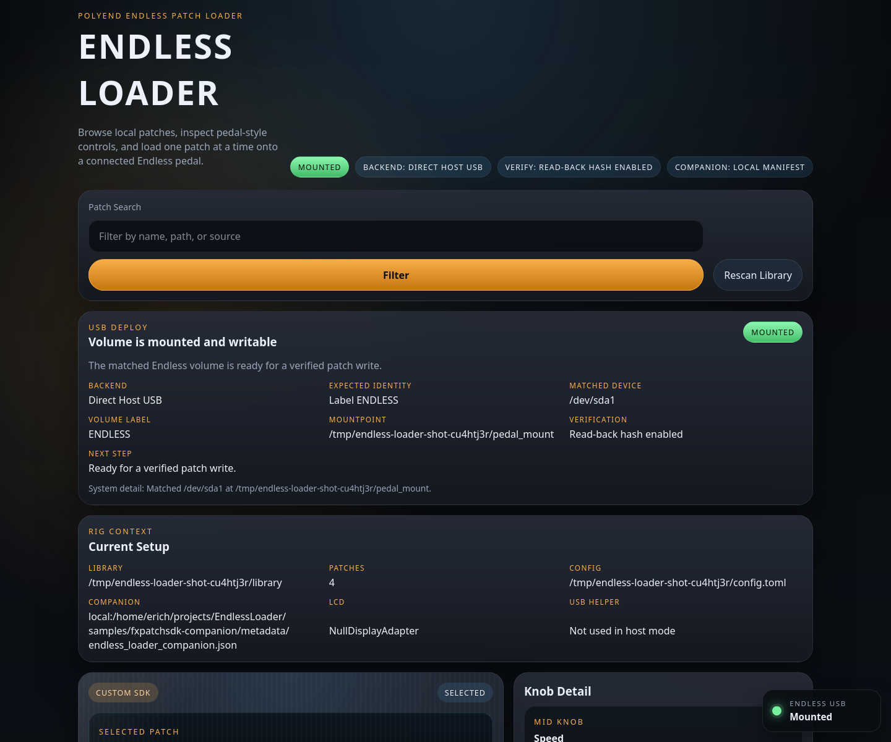
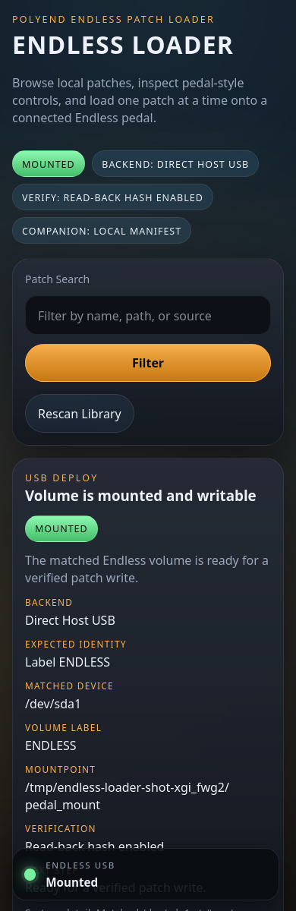
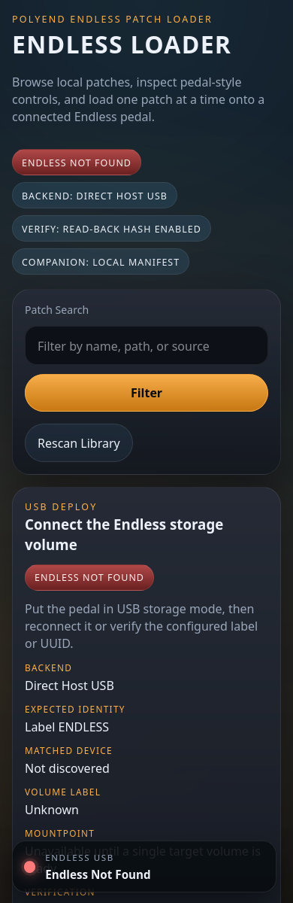

# Endless Loader

`Endless Loader` is a phone-first web server for browsing local `.endl` patches and loading one selected patch onto a connected Polyend Endless pedal. It is designed for Raspberry Pi OS on Pi 3B/4/5, and it also runs on Ubuntu-family Linux systems including Pop!_OS and standard Ubuntu desktops or mini PCs.



## What It Does

- Presents patches as a pedal-style control surface with labeled knobs.
- Discovers the Endless USB storage volume by label or UUID.
- Mounts the target volume when needed, copies the selected patch, and verifies the write with a read-back hash.
- Shows clear ready, pending, and error status through the USB panel and floating beacon.
- Updates an optional 1602 I2C LCD with the current patch name and compact knob labels.
- Uses optional companion metadata from `edonahue/FxPatchSDK` for richer descriptions, controls, actions, and links.
- Supports direct host USB control and Docker-friendly helper mode.

## Screenshots

Desktop console:


iPhone-width console:



USB not-ready guidance:



## Quick Start

Install system prerequisites on Raspberry Pi OS or Ubuntu-family Linux:

```bash
sudo apt install python3 python3-venv udisks2 util-linux
```

Install the app:

```bash
python3 -m venv venv
venv/bin/pip install -e ".[dev]"
cp config.example.toml config.toml
```

Edit `config.toml`:

```toml
library_root = "/path/to/endl/patches"

[usb]
mode = "host"
expected_label = "ENDLESS"
expected_uuid = ""
```

Run the server:

```bash
ENDLESS_LOADER_CONFIG=config.toml venv/bin/endless-loader
```

Open `http://localhost:8080`.

## Platform Support

The current app code is portable across:

- Raspberry Pi OS on Pi 3B/4/5
- Ubuntu 22.04+ and other Ubuntu-family distributions with Python 3.10+
- Pop!_OS as one Ubuntu-family example, not a special-case target

For `usb.mode = "host"`, the host needs:

- `lsblk`
- `findmnt`
- `udisksctl`

Those normally come from `util-linux` and `udisks2`.

## USB Certainty Model

When `usb.mode = "host"`, the app uses:

- `lsblk --json` to discover candidate block devices and partitions
- `findmnt --json` to determine the current mountpoint and read-only state
- `udisksctl mount` to mount the matched Endless volume when needed
- a temp-file copy plus atomic `os.replace` on the target volume
- `fsync` on the file and containing directory
- a read-back SHA-256 check when `usb.verify_hash = true`
- optional `udisksctl unmount` and `power-off` when `usb.auto_eject_after_write = true`

Use `usb.expected_uuid` for the strongest targeting. `usb.expected_label` is useful for first setup, but UUID matching avoids ambiguous writes if multiple removable volumes share a label.

## Docker Helper Mode

Docker runs the web app in `helper` mode so the container does not manage host USB mounts directly.

Run the helper on the host:

```bash
ENDLESS_LOADER_CONFIG=compose.helper.toml venv/bin/endless-loader-usb-helper
```

Start the container:

```bash
docker compose up --build
```

The included Compose config routes helper calls to `http://host.docker.internal:8755`.

## Companion Metadata

The app can show richer patch detail when a companion manifest exists at:

```text
metadata/endless_loader_companion.json
```

inside the `FxPatchSDK` checkout, or at the corresponding raw GitHub URL. A sample companion tree is included under [`samples/fxpatchsdk-companion`](samples/fxpatchsdk-companion).

## More Docs

- [Setup](docs/setup.md)
- [Troubleshooting](docs/troubleshooting.md)
- [Design Notes](docs/design.md)

## Screenshot Capture

Regenerate README screenshots with:

```bash
venv/bin/python scripts/capture_screenshots.py
```

The script requires Firefox on `PATH`.

## Tests

Run the test suite with:

```bash
venv/bin/pytest
```
